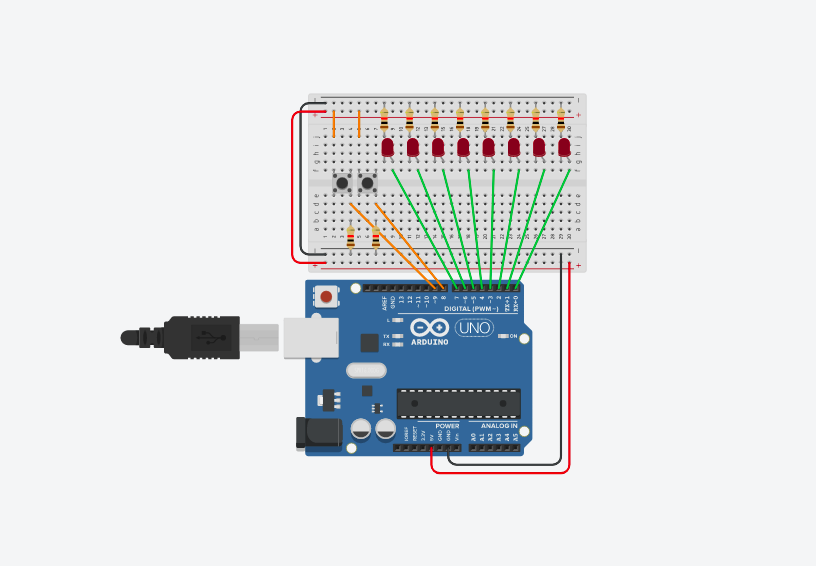

# Examples With Arduino Projects

## Turn ons leds sequence left to right and later of right to left in cicle infinite

[code this example](./codes/example-1.cpp)

## Move led for left or right through two buttons

[code this example](./codes/example-2.cpp)
